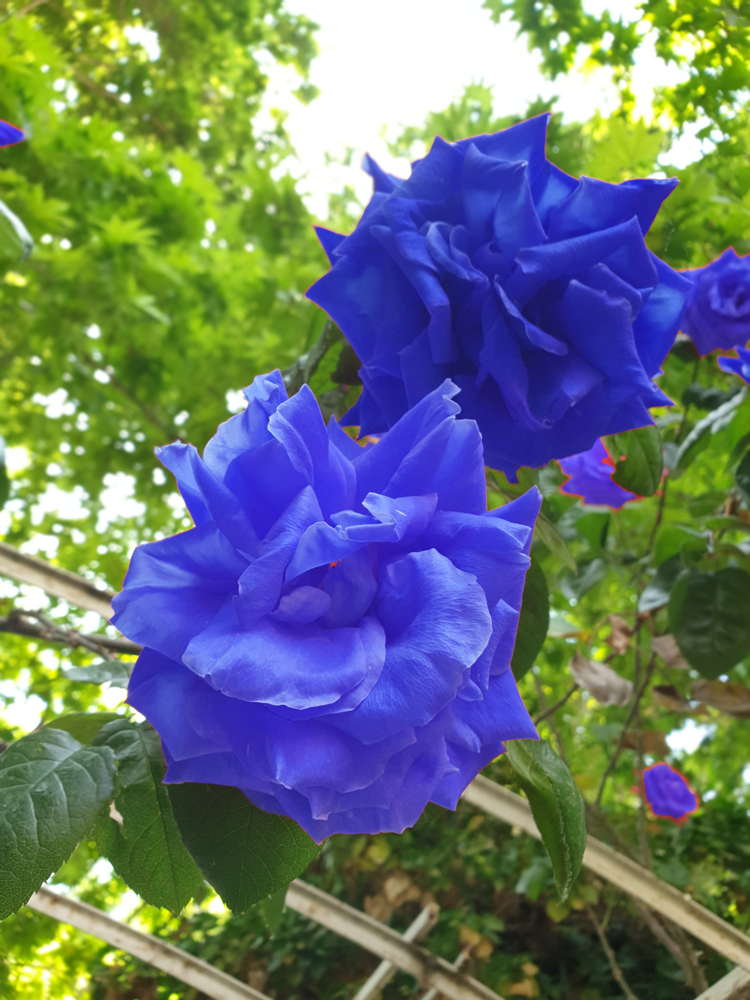

# **Image Recoloring**

In each input image, I had automatically find the place of flowers in RGB or HSV and then I changed the color of these pixels with appropriate function.

Imgae 1:

Imgae 1 recolored:

Imgae 2:

Imgae 2 recolored:

