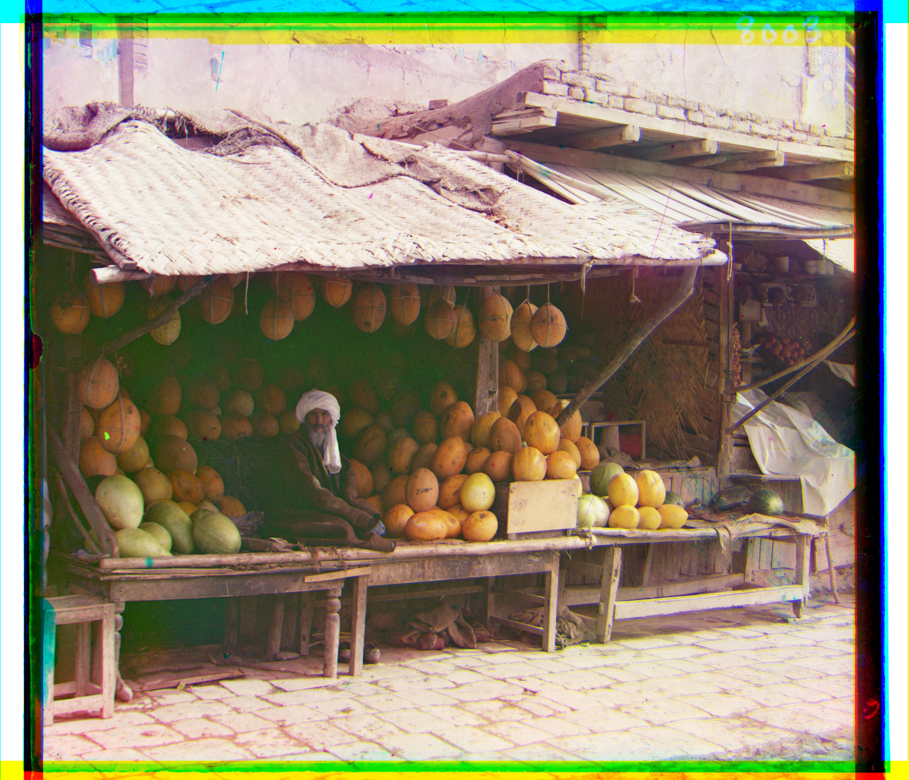

# **Prokudin-Gorskii_Images**

I have 3 channels of an old shop. The channels are not exactly fitted and the aim is to find exact horizontal and vertical shift to get the colorful image. Because the channels have big dimensions we can't search every possible horizontal and vertical shift. So I used pyramid method.

The original melons.tif was too heavy for git. 
So I uploaded this image in https://drive.google.com/file/d/1R_iW6y_T6QE4S8jVD7BDFF2jOL_Kf4Om/view?usp=sharing

3 channels:

colorful image:

