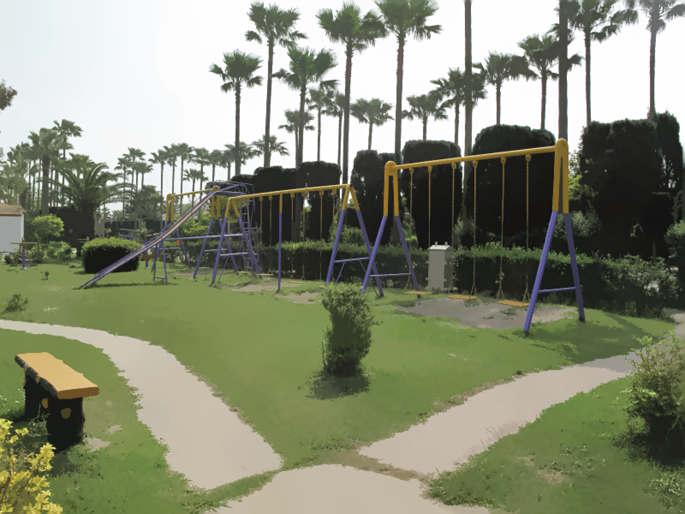

# **Mean Shift**

The Mean Shift segmentation is a local homogenization technique that is very useful for damping shading or tonality differences in localized objects. 

In this project, we aimed to apply this method on input image. The color of each segment is equal to an avrage of color of pixels in the segment.

Input Image:

Output Image:

