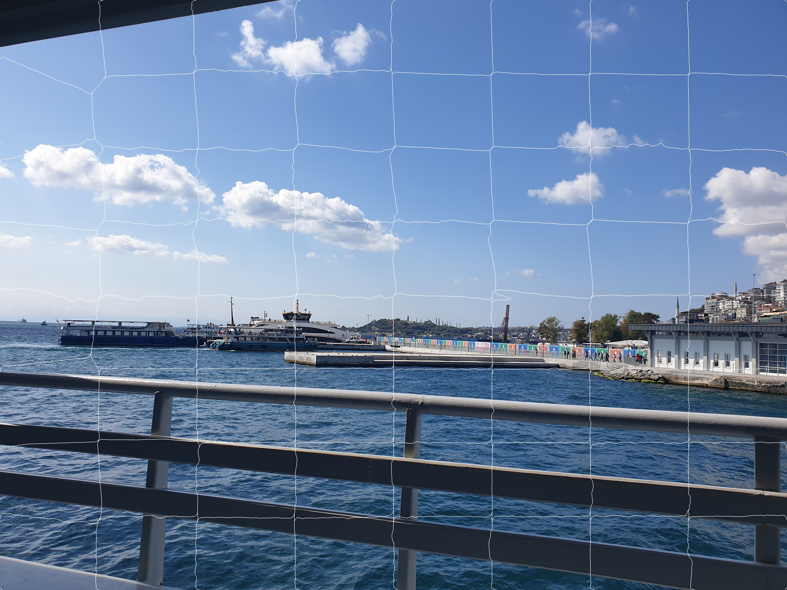
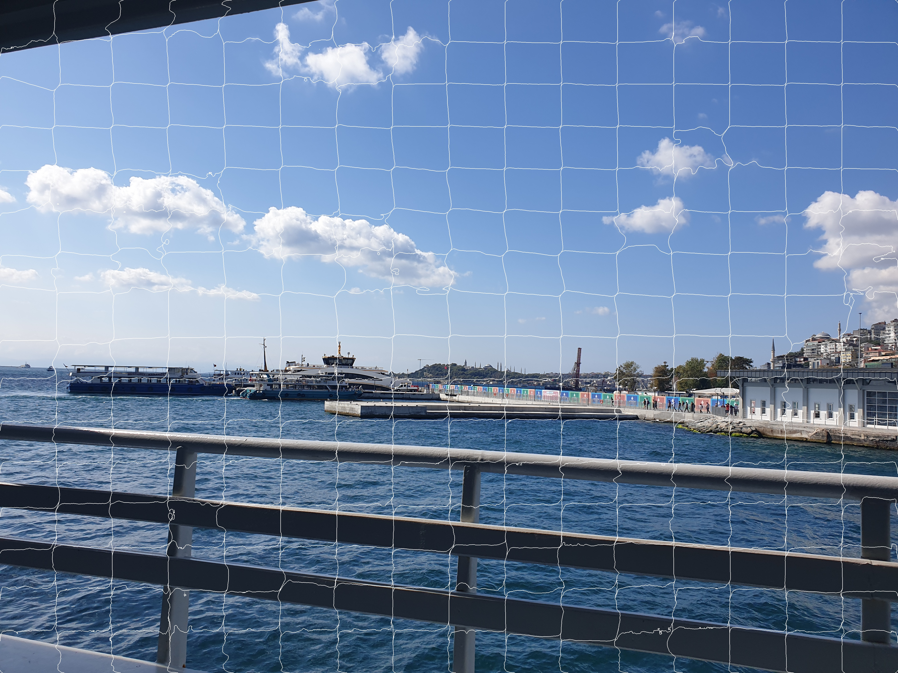

# **SLIC**

This algorithm generates superpixels by clustering pixels based on their color similarity and proximity in the image plane.  

This is done in the five-dimensional **labxy** space, where **lab** is the pixel color vector in CIELAB color space and **xy** is the pixel position. 

We need to normalize the spatial distances in order to use the Euclidean distance in this 5D space because the maximum possible distance between two colors in the CIELAB space is limited whereas the spatial distance in the xy plane depends on the image size.

𝑑𝑙𝑎𝑏 = (𝐿𝑘 − 𝐿𝑛)2 + (𝑎𝑘 − 𝑎𝑛)2 + (𝑏𝑘 − 𝑏𝑛)2

𝑑𝑥𝑦 = (𝑥𝑘 − 𝑥𝑛)2 + (𝑦𝑘 − 𝑦𝑛)2

d = 𝑑𝑥𝑦 + c 𝑑𝑙𝑎𝑏 

Input Image:

K = 64:

K = 256:

K = 1024:

K = 2048:

