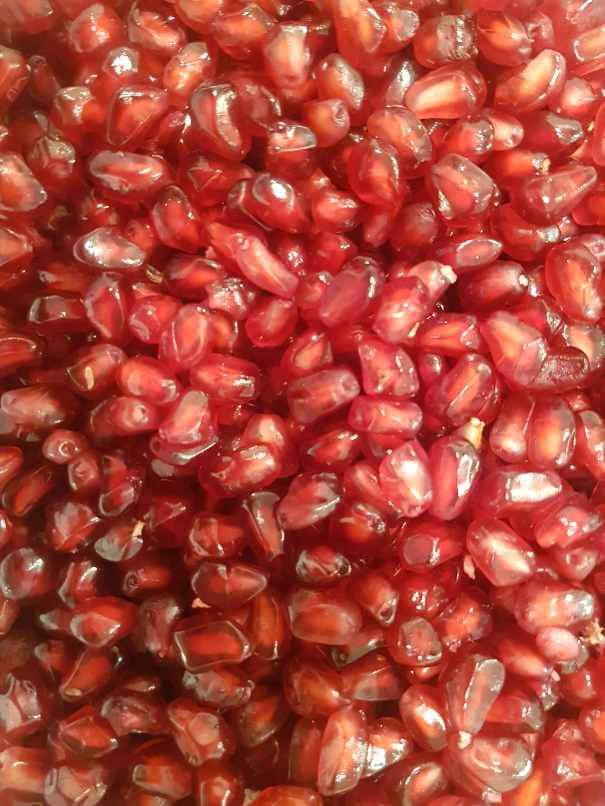
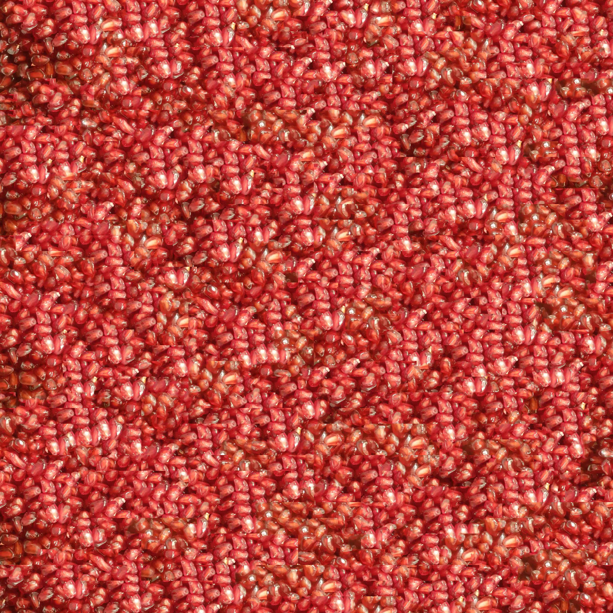

# **Texture Synthesis**

**Texture Synthesis** is the process of algorithmically constructing a large digital image from a small digital sample image by taking advantage of its structural content.  
Texture synthesis is important for many applications in computer graphics, vision, and image processing. However, it remains difficult to design an algorithm that is both efficient and capable of generating high quality result.  

Input Image :  
  

Texture Synthesis :  
  
